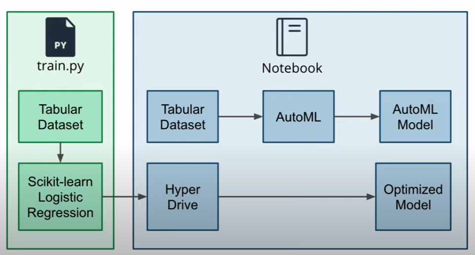
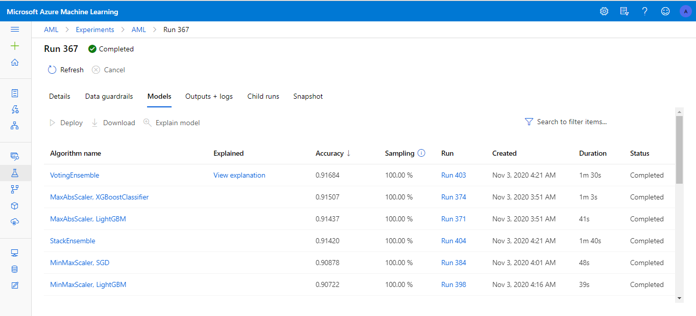
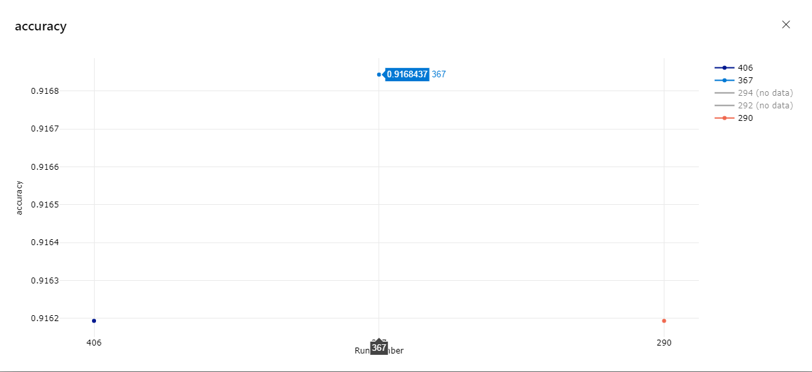
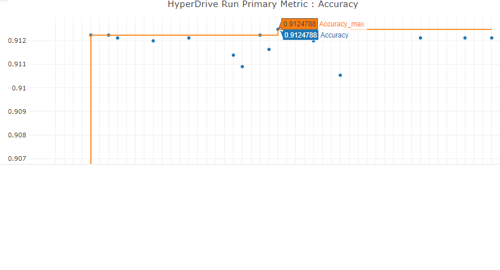

# Optimizing an ML Pipeline in Azure

## List of content
* [Overview](#overview)
* [Summary](#summary)
* [Scikit-learn Pipeline](#scikit-learn-pipeline)
* [AutoML](#automl)
* [Pipeline comparison](#pipeline-comparison)
* [Future work](#future-work)
* [Proof of cluster clean up](#proof-of-cluster-clean-up)
* [References](#references)

## Overview
This project is part of the Udacity Azure ML Nanodegree. The data of this projec is related with direct marketing campaigns of a Portuguese banking institution. The classification goal is to predict if the client will subscribe a term deposit (variable y). [Moro et al., 2014]
In this project, I build and optimize an Azure ML pipeline using the Python SDK and a provided Scikit-learn model.
This model was then compared to an Azure AutoML run.

## Summary
The data is related with direct marketing campaigns of a Portuguese banking institution. The marketing campaigns were based on phone calls. Often, more than one contact to the same client was required, in order to access if the product (bank term deposit) would be ('yes') or not ('no') subscribed. The classification goal is to predict if the client will subscribe (yes/no) a term deposit (variable y). [Moro et al., 2014]

The solution was tried in two ways:
- LogisticRegression model with scikit-learn / Azure HyperDrive.

- Azure AutoML to find the best accuracy.

The best performing model was a Voting Ensemble found using tuning the model's hyperparameters with Azure HyperDrive

## Scikit-learn Pipeline
**Explain the pipeline architecture, including data, hyperparameter tuning, and classification algorithm.**
The pipeline architecture is shown in the following figure:

The definition of the pipeline architecture, including data, adjustment of hyperparameters and classification algorithm observed the following steps:
<ol>
  <li>Setup Training Script (Review and Modify the `train.py` script)
    <ul>
      <li> Import data from the specified URL using "TabularDatasetFactory" </li>
      <li> Split data into train and test sets (70% for training and 30% for testing) </li>
      <li> Splitting of data into train and test data </li>
      <li> Using scikit-learn logistic regression model for classification </li>
    </ul>
  </li> 
  <li> Creation of a computing cluster, to HyperDrive, to running the train.py script containing the custom-coded Logistic Regression with a HyperDrive run
  </li> 
  <li> Review and modify the `project.ipynb` notebook
    <ul>
      <li> Specify the parameter sample </li>
      <li> Specify the policy for early stopping </li>
      <li> Creation of estimator for the train.py script </li>
      <li> Creation of HyperDriveConfig </li>
      <li> Submition of HyperDriveConfig to run the experiment </li>
      <li> Using the RunDetails widget to see the progress of the run </li>
      <li> Using the .get_best_run_by_primary_metric() method of the run to select the best hyperparameters for the model </li>
      <li> Save the best model </li>
    </ul>
  </li> 
</ol>     

The parameter sampler that we used was RandomParamaterSampler. One of the benefits of random sampling is that it supports discrete and continuous hyperparameters.  Moreover, it supports early termination of low-performance runs. We do not use Bayesian sampling because it does not support early termination policies. We don't use Grid sampling because can only be used with choice hyperparameters.

The early stopping policy that we chose was Median Stopping Policy with evaluation_interval 1 and delay_evaluation 5 because is a conservative policy that provides savings without terminating promising jobs. These are conservative settings, that can provide approximately 25%-35% savings with no loss on primary metric.

## AutoML

The AutoConfig configuration on the same Notebook observed the following steps:
<ol>
      <li> Cration of dataset from the provided URL using TabularDatasetFactory in the notebook </li>
      <li> Spliting data into train and test sets </li>
      <li> Modifying the AutoML configuration provided </li>
      <li> Submiting of AutoML run </li>
      <li> Saving the best model </li>
</ol>     
For the generation of the model and hyperparameters, the following specifications were used in AutoML: experiment_timeout_minutes=30, task='classification',     primary_metric='accuracy', label_column_name='y', iterations=50, max_concurrent_iterations = 5, enable_early_stopping = True and n_cross_validations=7. AutoML experimented with several models to find the model most accurately: ExtremeRandomTrees, RandomForest, LightGBM, XGBoost Classifier, etc, but the one that presented the best accuracy was VotingEnsemble (model predicts based on the weighted average of predicted class probabilities) with duration 0:01:31 and accuracy 0.9161933665727292, as described below:

## Pipeline comparison

The model originated from HyperDrive had the accuracy as described in the following image:

The accuracy from HyperDrive was Accuracy':0.9124787569798495, while the accuracy of AutoML model was valued: 0.9161933665727292. Therefore, the difference was 0,0037146095928797, that is, the accuracy is close. As for the architecture aspect, there is a great advantage of AutoML in terms of saving resources and more scope of experimentation when using a wide variety of algorithms.

## Future work

Some areas of improvement for future experiments are:
- Test different sampling methods
- specify different types of hyperparameter distributions
- Change the search space
- Exploring another range of values defined for each hyperparameter
- Exploring another early termination policy
- Using more data is the simplest and best possible way to prevent over-fitting

The implementation of these improvements in future work to improve the accuracy of the model and obtain new insights for the business. In addition, it is possible to develop pipelines that make it possible to reuse this model and continuous improvements.

## Proof of cluster clean up
**If you did not delete your compute cluster in the code, please complete this section. Otherwise, delete this section.**
**Image of cluster marked for deletion**

## References

<ol>
  <li> [Moro et al., 2014] S. Moro, P. Cortez and P. Rita. A Data-Driven Approach to Predict the Success of Bank Telemarketing. Decision Support Systems, Elsevier, 62:22-31, June 2014
  <li> [Moro et al., 2011] S. Moro, R. Laureano and P. Cortez. Using Data Mining for Bank Direct Marketing: An Application of the CRISP-DM Methodology. In P. Novais et al. (Eds.), Proceedings of the European Simulation and Modelling Conference - ESM'2011, pp. 117-121, Guimaraes, Portugal, October, 2011.
  <li> [Microsoft 2020] BanditPolicy class - Azure Machine Learning Python | Microsoft Docs. https://docs.microsoft.com/en-us/python/api/azureml-train-core/azureml.train.hyperdrive.banditpolicy?view=azure-ml-py
  <li> [Microsoft 2020] MedianStoppingPolicy class - Azure Machine Learning Python | Microsoft Docs. https://docs.microsoft.com/en-us/python/api/azureml-train-core/azureml.train.hyperdrive.medianstoppingpolicy?view=azure-ml-py
  <li> [Microsoft 2020] Tune hyperparameters for your model with Azure Machine Learning | Microsoft Docs. https://docs.microsoft.com/en-us/azure/machine-learning/how-to-tune-hyperparameters#define-search-space
  <li> [Microsoft 2020] RandomParameterSampling class - Azure Machine Learning Python | Microsoft Docs. https://docs.microsoft.com/en-us/python/api/azureml-train-core/azureml.train.hyperdrive.randomparametersampling?view=azure-ml-py
  <li> [2007-2020, scikit-learn deveopers] sklearn.model_selection.train_test_split — scikit-learn 0.23.2 documentation. https://scikit-learn.org/stable/modules/generated/sklearn.model_selection.train_test_split.html
  <li> [2007-2020, scikit-learn deveopers]sklearn.linear_model.LogisticRegression — scikit-learn 0.23.2 documentation. https://scikit-learn.org/stable/modules/generated/sklearn.linear_model.LogisticRegression.html
  </li> 
</ol>  
